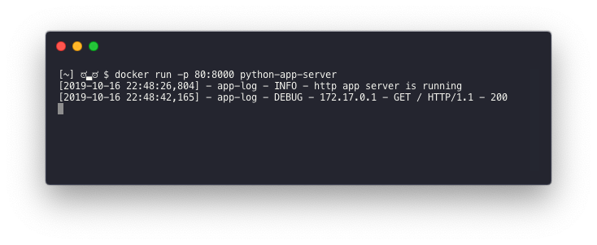
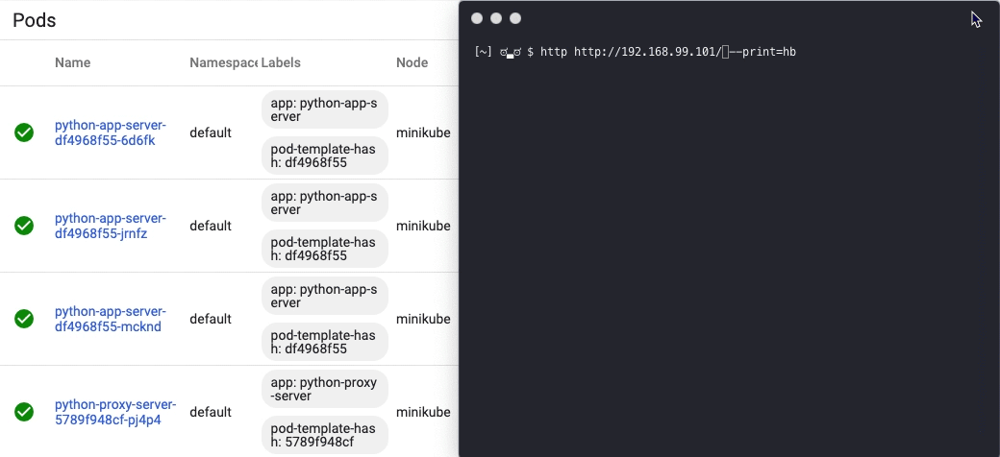

# Project 

This Project is a test that I to share my expirence creating a Kubernetes Cluster with 2 apps that talk to each other 
* Application Development/Implementation
  * Python APP Server
  * Python Proxy Server
* Deployment/Automation
  * Kubernees
  * helm
* Deployment Strategy
 


# Application Development
## APP Server

[This application](app/app-server.py) will respond to http request with a JSON Body with a 200 ok message. It will also listen for the HTTP requests with the path `/fail` which will cause the application server to die.

Functions/Classes:
* startServer: Creates the httpServer and configures it to listen on TCP Port 8000
```python
def startServer():
    port = 8000
    ip = '0.0.0.0'
    configure_error_logging()
    logger.info('http app server is running')

    httpd = HTTPServer((ip,port), HTTPRequestHandler)
    httpd.serve_forever()
```
* configure_error_logging: Uses the logging liberty and logs all events to /tmp/proxy/event.log 
```python
def configure_error_logging():
    logger.setLevel(logging.DEBUG)
    # Format for our loglines
    formatter = logging.Formatter("[%(asctime)s] - %(name)s - %(levelname)s - %(message)s")
    # Setup console logging
    ch = logging.StreamHandler()
    ch.setLevel(logging.DEBUG)
    ch.setFormatter(formatter)
    logger.addHandler(ch)
    directory = "/tmp/proxy/"
    if not os.path.exists(directory):
        os.makedirs(directory)
    LOG_FILENAME = directory+"event.log"
    print(LOG_FILENAME)
    # Setup file logging as well
    fh = logging.FileHandler(LOG_FILENAME)
    fh.setLevel(logging.DEBUG)
    fh.setFormatter(formatter)
    logger.addHandler(fh)
```
* HTTPRequestHandler/do_GET: Handle for HTTP Get Requests. It creates a HTTP response body and simulates an outage.
```python
class HTTPRequestHandler(BaseHTTPRequestHandler):
    protocol_version = 'HTTP/1.1'

    def do_GET(self, body=True):
            try:
                #Recreate Server Header to obscure Software Versions
                self.server= ""
                self.server_version = "APP Server"
                self.sys_version = ""

                if self.path == "/fail":
                    sys.exit()
                else:
                    self.send_response_only(200)
                    body = {"message":"you got this!"}
                # Configure HTTP Response Headers
                self.send_header('Server','Jeju')
                x = datetime.datetime.now()
                self.send_header('Date',x.strftime("%c"))
                self.send_header('Content-type','application/json')
                body = {"message":"you got this!"}
                self.send_header('Content-Length',len(json.dumps(body).encode()))
                self.end_headers()
                # END Headers
                # Send Body

                self.wfile.write(json.dumps(body).encode())
                
                self.wfile.flush() #actually send the response if not already done.
                self.close_connection= 1 #Close Connection
                # Log Request
                logger.debug("{} - {} - {} ".format(self.address_string(),self.requestline,200))
            except Exception as e:
                # Log Error
                self.log_error("Request got ab error out: %r", e)
                logger.error("{} - {} - {} ".format(self.address_string(),self.requestline,200))
                self.close_connection = 1
                return
```


### Deploy APP Server Docker Image
Beause we need to deploy this application to Kubernetes we need to create a image that we will later deploy in our cluster. 

To do this I created my image with this [dockerfile](docker/App-Dockerfile) (All Docker files can be found under the /docker/ directory.). I chose to use alpine since its light weight, then copied my app and requirements for it. Which I generated with the command `python3 -m  pip freeze > requirements.txt`.

```docker
FROM python:3.7-alpine
ADD app-server.py /
ADD requirements.txt /
RUN pip install -r requirements.txt
EXPOSE 8000
CMD python app-server.py
```

Steps:
1. Build the image using the docker file above as follows.
```sh
docker build -t python-app-server -f docker/App-Dockerfile .
```
2. Tag the image as latest
```sh
docker tag XXXXXX rmartinezb/python-app-server:lastest
```
3. Push to repository.
```sh
docker push rmartinezb/python-app-server
```
At this point the image is ready to be used.
```sh
docker run -p 80:8000 python-app-server
```


## Proxy Server

The application will accept http requests on port a configurable port and route traffic to services that are also configurable.

Functions/Classes:
* configure_error_logging: configure_error_logging: Uses the logging liberty and logs all events to `/tmp/proxy/event.log`
```
def configure_error_logging():
    logger.setLevel(logging.DEBUG)
    # Format for our loglines
    formatter = logging.Formatter("[%(asctime)s] - %(name)s - %(levelname)s - %(message)s")
    # Setup console logging
    ch = logging.StreamHandler()
    ch.setLevel(logging.DEBUG)
    ch.setFormatter(formatter)
    logger.addHandler(ch)
    directory = "/tmp/proxy/"
    if not os.path.exists(directory):
        os.makedirs(directory)

    LOG_FILENAME = directory+"event.log"
    
    # Setup file logging as well
    fh = logging.FileHandler(LOG_FILENAME)
    fh.setLevel(logging.DEBUG)
    fh.setFormatter(formatter)
    logger.addHandler(fh)
```
* ProxyHTTPRequestHandler/do_get: Handle for HTTP Get Requests. It load balances traffic across multiple services/nodes.
```python
class ProxyHTTPRequestHandler(BaseHTTPRequestHandler):
    protocol_version = 'HTTP/1.1'
   

    def do_GET(self, body=True):

            try:
                url = 'https://{}{}'.format(hostname, self.path)

                s =roundRobinService()
                o = roundRobinOrigin(s)
               
                self.server= ""
                self.server_version = ""
                self.sys_version = ""

                endpoint="http://{}:{}{}".format(nodes[s][2][o]['address'],nodes[s][2][o]['port'],self.path)
                
               
                http = requests.Session()
                resp = http.get(endpoint, verify=False) 
                self.send_response_only(resp.status_code)
                self.send_header("Host","{}-{}-{}".format(nodes[s][0],nodes[s][2][o]['address'],nodes[s][2][o]['port']))
                for k,v in resp.headers.items():
                    self.send_header(k,v)
                self.end_headers()
                             
                self.wfile.write(resp.text.encode())
                self.wfile.flush() #actually send the response if not already done.
                self.close_connection= 1
                logger.error("{} - {} - {} ".format(self.address_string(),self.requestline,200))
            except Exception as e:

                self.log_error("Request got ab error out: %r", e)
                logger.error("{} - {} - {} ".format(self.address_string(),self.requestline,200))
                self.close_connection = 1
```
* load_proxy_config: Reads/Opens `config.yaml` configuration file and converts it to a dict. 
```python
def load_proxy_config(config_file):
    with open(config_file, 'r') as stream:
        try:
            return yaml.safe_load(stream)
        except yaml.YAMLError as exc:
            print(exc)
```
* findServices: Finds services within yaml config file and passes to `getOrigins()` to find nodes to route traffic.
```python
def findServices():
    for s in config['proxy']['services']:
        if s['name'] == service:
            return s
    return None

```
```python
def getOrigins():
    global nodes
    services = config['proxy']['services']
    for s in services:
        o=[]
        for h in s['host']:
            i={}
            i['address']=h['address']
            i['port']=h['port']
            o.append(i)
        temp=[s['name'],-1,o]
        nodes.append(temp)
```
* roundRobinService: Uses RoundRobin to route to services and onces service is selected calls `roundRobinOrigin()` to select node.
* roundRobinOrigin: Uses Round Robin to route to multiple nodes.
```python
def roundRobinService():
    
    global n
    n += 1
    return (n% len(nodes))

def roundRobinOrigin(i):
    
    global n
    nodes[i][1] += 1
    return (n% len(nodes[i][2]))
```
### Deploy Proxy Server Docker Image
Again, we need to deploy this application to Kubernetes we need to create a image that we will later deploy in our cluster, same steps as app server

To do this I created my image with this [dockerfile](docker/Proxy-Dockerfile) (All Docker files can be found under the /docker/ directory.). requirements.txt`.

```docker
FROM python:3.7-alpine
ADD proxy-server.py /
ADD requirements.txt /
ADD config.yaml /
ADD bootstrap.sh /
RUN pip install -r requirements.txt
EXPOSE 8888
CMD sh bootstrap.sh
```

Steps:
1. Build the image using the docker file above as follows.
```sh
docker build -t python-proxy-server -f docker/Proxy-Dockerfile .
```
2. Tag the image as latest
```sh
docker tag XXXXXX rmartinezb/python-proxy-server:lastest
```
3. Push to repository.
```sh
docker push rmartinezb/python-proxy-server
```
At this point the image is ready to be used.




http http://127.0.0.1 -b


# Deployment

I 

# Suporting Documentation:
* https://kubernetes.io/blog/2019/07/23/get-started-with-kubernetes-using-python/

* https://matthewpalmer.net/kubernetes-app-developer/articles/guide-install-kubernetes-mac.html


https://blog.realkinetic.com/building-minimal-docker-containers-for-python-applications-37d0272c52f3

https://runnable.com/docker/python/dockerize-your-python-application


kubectl delete services python-app-service
kubectl delete deployment python-app-server


## Run container

```sh
docker run -p 80:8000 python-app-server
```
kubectl delete deploy tiller-deploy -n kube-system

kubectl delete service tiller-deploy -n kubesystem
kubectl create serviceaccount tiller --namespace kube-system
kubectl create clusterrolebinding tiller-cluster-rule  --clusterrole=cluster-admin  --serviceaccount=kube-system:tiller

helm init --service-account tiller --override spec.selector.matchLabels.'name'='tiller',spec.selector.matchLabels.'app'='helm' --output yaml | sed 's@apiVersion: extensions/v1beta1@apiVersion: apps/v1@' | kubectl apply -f -


 kubectl create serviceaccount tiller --namespace kube-system
 kubectl create clusterrolebinding tiller-cluster-rule  --clusterrole=cluster-admin  --serviceaccount=kube-system:tiller


 apiVersion: extensions/v1beta1
kind: Ingress
metadata:
  name: ingress-app
  annotations:
    http.port: "80"
spec: 
  backend: 
    serviceName: service-app-1
    servicePort: 80

---

https://kubernetes.io/docs/tasks/configure-pod-container/configure-liveness-readiness-startup-probes/

kubectl exec -it python-proxy-server-5789f948cf-pj4p4 -- /bin/sh

==> v1/Service
NAME           TYPE       CLUSTER-IP     EXTERNAL-IP  PORT(S)   AGE
service-app-1  ClusterIP  10.103.75.163  <none>       8081/TCP  0s
service-app-2  ClusterIP  10.106.17.9    <none>       8081/TCP  0s
service-proxy  ClusterIP  10.97.152.69   <none>       8888/TCP  0s

